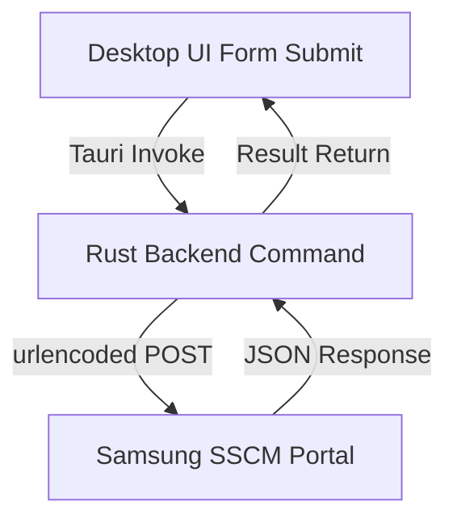

# Es-Pelem 🚀

[](https://github.com/endrisusanto/Es-Pelem/actions/workflows/release.yml)
[](https://tauri.app)
[](https://www.rust-lang.org)
[](LICENSE)

**Es-Pelem** is a modern, lightweight, standalone desktop firmware utility designed to fetch and inspect Samsung firmware release logs directly from the SSCM portal. Built with a high-end, glassmorphic dark-theme UI on **Tauri (Rust + Vanilla HTML/CSS/JS)**.

---

## 🏗️ Architecture Layout

The application operates as a standalone client without requiring any browser extensions or external proxies:



* **Frontend Dashboard (`/src`)**: Form inputs collect parameters (AP, CP, CSC, Model Name, and Date Range) and dispatch them to the native shell on submit. Handoff is visual, displaying responsive load indicators and live grid updates.
* **Rust Core (`/src-tauri`)**: Makes direct HTTPS POST requests to `http://mdvh.sec.samsung.net/sscm/appm/srbin/pjt/getReleaseListAjax.do` using the lightweight `ureq` HTTP library, cleanly bypassing browser CORS constraints.

---

## 🌟 Key Features

* **Direct Portal Querying**: Enter parameters directly into the app and submit. The native backend queries the live Samsung portal and renders the returned records instantly.
* **Advanced Filter Form**: Fill parameters to restrict query scope or locally filter loaded records:
  - **AP Version** (`codeVersion`)
  - **CP Version** (`bbVersion`)
  - **CSC Version** (`cscVersion`)
  - **Dev Model Name** (`modelNm`)
  - **Release Date/Time Range**
* **Offline Mock Caching**: Pre-loaded with sample release logs so you can browse, filter, and test the app interface immediately offline.
* **Firmware Details Viewer**: Click on any grid row to open an overlay panel with extensive metadata (One UI version, Knox version, target countries list, changelist number, FOTA dates, status logs, and database keys).
* **Manual Data Importer**: A JSON paste panel that allows manual clipboard imports of raw responses if needed.

---

## 🛠️ Development & Local Setup

### Prerequisites

Ensure you have the standard Tauri and Rust tools installed:
* [Rust & Cargo](https://www.rust-lang.org/tools/install)
* [Node.js & npm](https://nodejs.org)
* Platform build tools (e.g., C compiler for Rust compilation).

### Running the Desktop App

1. Clone the repository:
   ```bash
   git clone https://github.com/endrisusanto/Es-Pelem.git
   cd Es-Pelem
   ```
2. Install npm CLI dependencies:
   ```bash
   npm install
   ```
3. Start the Tauri app in developer mode:
   ```bash
   npm run tauri dev
   ```

---

## 📦 Automated Release Pipeline

We use a tag-based automated compiler to build and publish Windows installer files (`.msi`).

### Local Release Trigger

To prepare a version bump, compile checks, and trigger a release:
1. Run the local release script from the root folder:
   ```bash
   # Bumps patch version (e.g., 0.1.5 -> 0.1.6) and triggers release
   ./scripts/release.sh patch
   
   # Bumps minor version (0.1.5 -> 0.2.0)
   ./scripts/release.sh minor
   
   # Or pass a specific semver tag
   ./scripts/release.sh 1.2.3
   ```
2. The script will automatically:
   - Update `package.json`, `src-tauri/tauri.conf.json`, and `src-tauri/Cargo.toml` with the new version.
   - Run compilation checks (`cargo check`).
   - Create a local git commit and tag (e.g. `v0.1.6`).
   - Push the code and tags to the remote repository.

### GitHub Actions Compiler

Upon receiving a version tag (`v*`), the GitHub Actions release workflow (`.github/workflows/release.yml`) automatically triggers:
1. Boots a **Windows Runner** (`windows-latest`).
2. Installs Rust and Node compilation hooks.
3. Packages the Tauri application into a production-ready **Windows MSI installer** using the built-in Wix toolkit.
4. Publishes a GitHub Release page containing the compiled MSI file.

---

## 📄 License

This project is licensed under the MIT License. See [LICENSE](LICENSE) for details.
